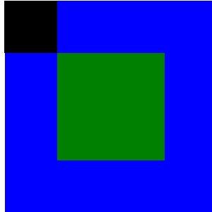

# Posicionando Cajas
Posicionando cajas es una pagina, en la cual se ha replicado dos figuras.  
Para la relizacion de la pagina se muestra los conocimietnos aprendidos en clase sobre HTML e introduccion a css: positioning.

Se replico las siguientes figuras:  

** muestra 1**  

** muestra 2**  

